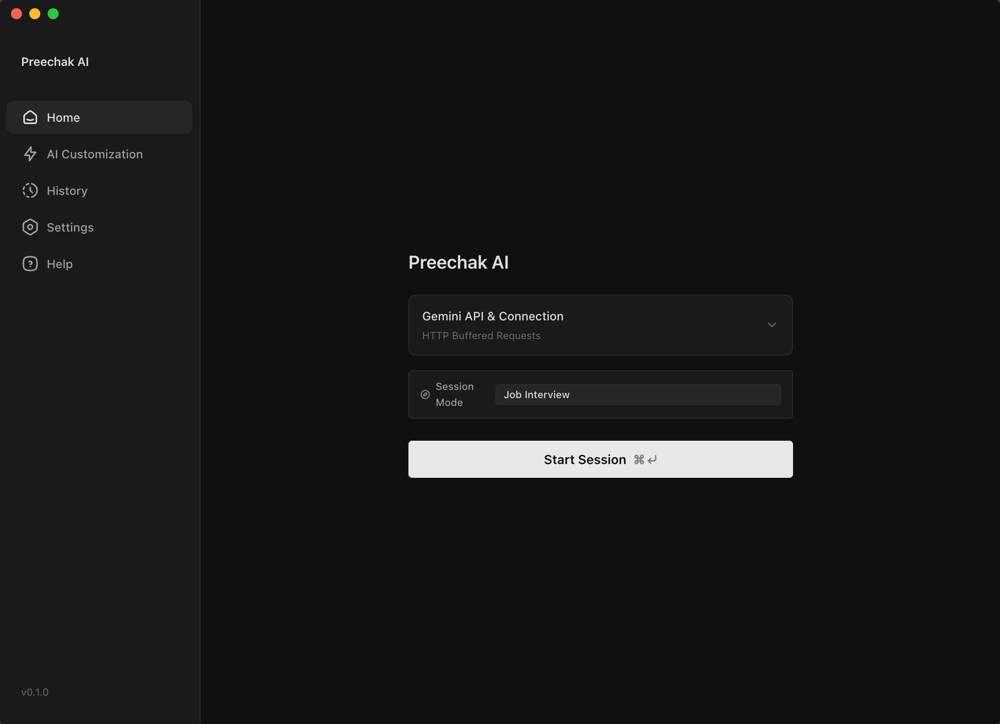
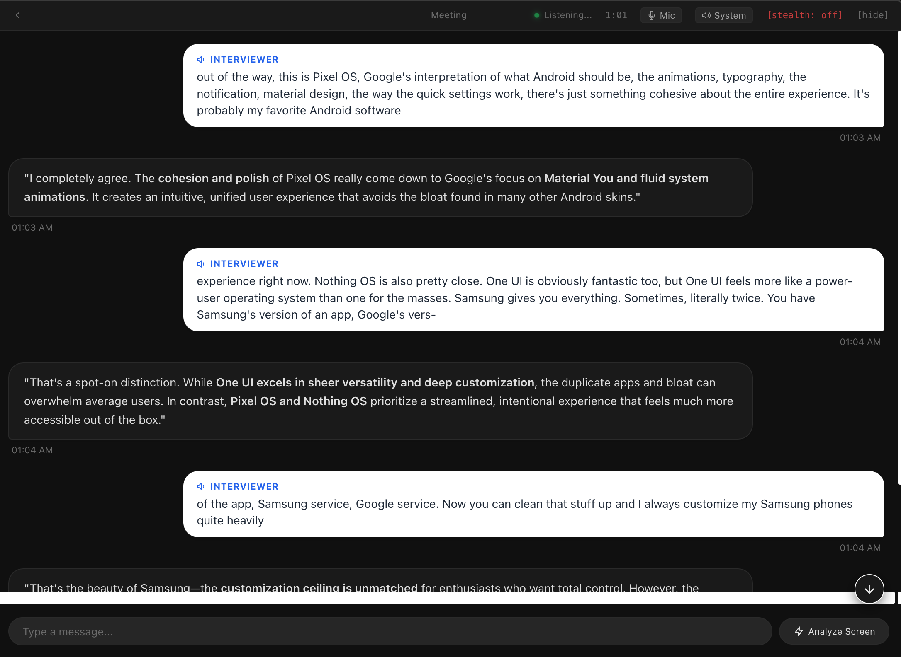

# Preechak AI





Preechak AI is an Electron desktop assistant that uses screen captures and audio to provide contextual AI responses. It supports API-based sessions with Gemini and Groq, plus local inference with llama.cpp and whisper.cpp.

## Features

- Live audio transcription and contextual responses.
- Manual screenshot questions and configurable automatic screen captures.
- Typed questions, response navigation, and Markdown/code rendering.
- Profiles for interviews, meetings, sales, presentations, negotiations, and exams, with editable instructions and screenshot prompts.
- System audio, microphone, or both, with microphone device selection.
- An always-on-top overlay with adjustable transparency, font size, themes, and click-through mode.
- Stealth mode using Electron content protection and platform-specific window visibility options. Capture behavior depends on the operating system and recording application.
- Local session history with transcripts, responses, screenshots, editable titles, search, and deletion controls.
- Configurable global keyboard shortcuts.

## Run from source

Install Node.js and npm, then clone and run the project:

```bash
git clone git@github.com:phillippree/preechak-ai.git
cd preechak-ai
npm ci
npm start
```

The SSH clone requires a GitHub key with access to this repository. You can also use the repository's HTTPS clone URL.

Grant screen recording and microphone permissions when requested. On macOS, check **System Settings → Privacy & Security** if capture fails, then restart the app after changing permissions.

## Choose an AI mode

### Use your own API keys

On the home screen:

1. Under **Gemini API & Connection**, enter your Gemini API key and choose your **Connection Mode**:
    - **Live Streaming (WebSocket)**: Connects to Gemini Live (`gemini-3.1-flash-live-preview`) for bidirectional real-time audio.
    - **Buffered Requests (HTTP)**: Buffers audio segments on speech pauses and sends requests via HTTP REST (`gemini-3.8-flash`, `gemini-2.0-flash`, `gemini-1.5-pro`, etc.).
2. Under **AI responses**, optionally enter a Groq API key and configure the response and image models.
3. Choose your profile, audio input, language, and prompts in the app's settings and AI customization views.
4. Click **Start Session**.

With a Groq key, the app can use Groq for responses; without one, Gemini is used directly for answers. Image questions require a model that supports images.

### Gemini HTTP context management, shared screenshots, and token budgeting

In HTTP mode, speech segments are transcribed first, then answered with full conversation awareness and optional active screenshot attachments:

- **Shared Conversation Memory & Screenshot Context**:
    - Spoken, typed, and screenshot exchanges share a unified conversation history with rolling summary and token budgeting.
    - Capturing a screenshot automatically makes it the active image for subsequent spoken or typed follow-up questions until removed or replaced.
    - Screenshots are stored once on disk; conversation turns store lightweight image references rather than duplicating Base64 data.
    - Older screenshots contribute their discussion as text in subsequent turns without re-attaching raw image payloads unless explicitly selected.
- **Attachment Controls**:
    - Selected image thumbnails appear above the question input bar in `AssistantView`.
    - **Remove (`✕`)**: Excludes an attachment from upcoming requests without deleting its saved file on disk.
    - **Compare with previous (`⇆`)**: Attaches both the current and immediately preceding screenshots with explicit ordering labels (`[Attached Image 1 (Current)]`, `[Attached Image 2 (Previous)]`).
    - **History Picker (`📷`)**: Allows selecting any earlier capture from the session (supporting up to 2 attached images).
- **Queue Snapshotting & Request Correctness**:
    - Spoken questions snapshot active attachments at speech segment start time so subsequent captures during transcription do not retroactively attach to older questions.
    - Typed questions snapshot active attachments upon message submission.
    - Session restarts or disconnects clear active attachments and discard queued requests.
- **Token-budgeted recent history**: Retains recent complete exchanges up to a configurable budget (default: 4,000 tokens) in their original `user` and `model` roles.
- **Running conversation summary**: When history exceeds the token budget, older exchanges are automatically condensed into a compact factual summary (target: 500 tokens) that is prepended to subsequent requests.
- **Role & attribution preservation**: Summaries explicitly distinguish interviewer questions, the user's spoken statements (`[You]`), screenshot analyses, and AI-suggested answers without misattributing claims.
- **Cost vs. quality tradeoffs**:
    - _Image tokens_: Each attached image contributes ~258 estimated tokens to the request context.
    - _Higher budget_ (e.g. 8,000 tokens): Better recall of exact phrasing in long sessions, higher per-request input token costs.
    - _Lower budget_ (e.g. 2,000 tokens): Lower token usage, triggers summarization sooner to condense older details.

Model and context configuration defaults:

| Setting               | Default in this checkout        | Purpose                                                  |
| --------------------- | ------------------------------- | -------------------------------------------------------- |
| Gemini Live           | `gemini-3.1-flash-live-preview` | Live WebSocket streaming model                           |
| Gemini HTTP Model     | `gemini-3.8-flash`              | HTTP REST model for transcription, answers, and images   |
| Recent History Budget | `4000` tokens                   | Maximum token allocation for recent conversational turns |
| Summary Target        | `500` tokens                    | Target token length for the running background summary   |
| Groq response model   | `qwen/qwen3.6-27b`              | Optional Groq answer generation model                    |
| Groq image model      | `qwen/qwen3.6-27b`              | Optional Groq screenshot analysis model                  |

These are configuration defaults, not a guarantee of provider availability or image support. Use model IDs supported by your provider account.

### Use local AI

Select **Use local AI** on the home screen, choose a language model and Whisper model, then click **Start Session**.

- Language inference runs through **llama.cpp**; transcription runs through **whisper.cpp**. Ollama is not required.
- The default language model is `unsloth/Qwen3.5-4B-GGUF:Q4_K_M`.
- You can select a preset, enter a Hugging Face model reference, or provide an absolute path to a local GGUF file.
- Whisper options are `tiny.en`, `base.en`, and `small.en`; these are English models.
- First use downloads the native runners and required models. Allow sufficient disk space and memory for your selected model.
- Local inference runs on your computer; initial downloads require internet access.

The runtime downloader currently defines builds for **macOS Apple Silicon**, **macOS Intel**, and **Windows x64**. It does not define a Linux local-AI build.

**Current download dependency:** native runners are fetched from `preechak-ai/preechak-ai` release `v0.7.0`, as configured in `src/utils/native-ai-runtime.js`. Those assets must be available for automatic setup to succeed; they are not fetched from this fork's GitHub repository.

## Default hotkeys

On macOS, **Option** is the key shown as `Alt` in the shortcut settings. Global shortcuts work while the app is running, subject to operating-system conflicts.

| Action                                                                     | macOS                 | Windows / Linux       |
| -------------------------------------------------------------------------- | --------------------- | --------------------- |
| Move window                                                                | `Option + Arrow keys` | `Ctrl + Arrow keys`   |
| Show / hide window                                                         | `Cmd + \`             | `Ctrl + \`            |
| Toggle click-through                                                       | `Cmd + M`             | `Ctrl + M`            |
| Toggle stealth mode                                                        | `Cmd + Shift + H`     | `Ctrl + Shift + H`    |
| Start session from home; capture and ask about the screen during a session | `Cmd + Enter`         | `Ctrl + Enter`        |
| Previous response                                                          | `Cmd + [`             | `Ctrl + [`            |
| Next response                                                              | `Cmd + ]`             | `Ctrl + ]`            |
| Scroll response up                                                         | `Cmd + Shift + Up`    | `Ctrl + Shift + Up`   |
| Scroll response down                                                       | `Cmd + Shift + Down`  | `Ctrl + Shift + Down` |
| Increase opacity                                                           | `Option + .`          | `Alt + .`             |
| Decrease opacity                                                           | `Option + ,`          | `Alt + ,`             |
| Send a typed message while its input is focused                            | `Enter`               | `Enter`               |
| Emergency erase and quit                                                   | `Cmd + Shift + E`     | `Ctrl + Shift + E`    |

Edit the listed global shortcuts in **Settings**, or use **Reset to defaults**. The emergency shortcut is registered at startup but is not exposed in the shortcut editor; changing or resetting shortcuts can unregister it until the app restarts. `Enter` is a message-input action, not a configurable global shortcut.

**Emergency erase is destructive:** it hides the window, closes the Gemini session if present, requests a reset of local app data, and quits after a short delay. It is not a verified secure-erasure mechanism. Use the explicit history/settings deletion controls when you need to confirm data removal.

Click-through sends mouse interactions to the application behind the overlay. Use its shortcut again to interact with Preechak AI. Show/hide changes window visibility; it does not end the session.

## Audio and platform notes

- **macOS:** the bundled SystemAudioDump helper captures system audio; microphone capture can run separately or alongside it.
- **Windows:** system audio uses display/loopback capture; microphone-only and combined modes are implemented.
- **Linux:** the app attempts display-based system audio capture and supports microphone capture. System audio depends on the desktop environment; the speaker-only path falls back to screen capture if audio capture fails.

These describe the implemented capture paths, not a cross-platform test certification.

## Project files

Paths in this section are relative to the project folder, shown generically as `<project-root>/`. User data is stored separately in the locations below.

| File or folder                           | Purpose                                                                               |
| ---------------------------------------- | ------------------------------------------------------------------------------------- |
| `package.json` / `package-lock.json`     | App metadata, commands, dependencies, and locked dependency versions                  |
| `forge.config.js` / `entitlements.plist` | Electron packaging configuration and macOS entitlements                               |
| `src/index.js`                           | App startup and background handlers for interface requests                            |
| `src/index.html`                         | Loads the interface and renderer scripts                                              |
| `src/components/app/`                    | Main app layout, navigation, and session controls                                     |
| `src/components/views/`                  | Home, assistant, history, settings, onboarding, and AI customization screens          |
| `src/utils/window.js`                    | Window behavior, global hotkeys, capture protection, and screenshot handlers          |
| `src/utils/renderer.js`                  | Screen/microphone capture, UI-to-background messages, and storage requests            |
| `src/utils/gemini.js`                    | Gemini Live, Groq requests, provider routing, macOS audio capture, and session events |
| `src/utils/gemini-http.js`               | Buffered audio requests through the Gemini HTTP API                                   |
| `src/utils/localai.js`                   | Local speech detection, Whisper transcription, and llama.cpp requests                 |
| `src/utils/native-ai-runtime.js`         | Downloads and manages local AI runners and model files                                |
| `src/utils/prompts.js`                   | Profile-specific AI instructions                                                      |
| `src/utils/transportLogger.js`           | Writes session transport event logs                                                   |
| `src/utils/cloud.js`                     | Cloud connection backend; its setup option is currently hidden in the interface       |
| `src/storage.js`                         | Reads and writes settings, credentials, history, and screenshots                      |
| `src/audioUtils.js`                      | Audio conversion and optional debug recording helpers                                 |
| `src/assets/`                            | Icons, onboarding artwork, bundled UI libraries, and the macOS SystemAudioDump helper |
| `documents/`                             | Project documentation, including [architecture diagrams](documents/architecture.md)   |
| `node_modules/`                          | Installed dependencies; generated by npm and ignored by Git                           |
| `out/`                                   | Packaged applications and installers; generated by Electron Forge and ignored by Git  |

## Local data and storage locations

The app stores its own persistent data outside the project folder. In the tables below, `~` means the current user's home directory, `%USERPROFILE%` is the Windows user profile, and `<config-dir>` means the platform-specific directory below.

| Platform | Configuration directory                             |
| -------- | --------------------------------------------------- |
| macOS    | `~/Library/Application Support/preechak-ai-config/` |
| Windows  | `%USERPROFILE%\AppData\Roaming\preechak-ai-config\` |
| Linux    | `~/.config/preechak-ai-config/`                     |

### Files inside the configuration directory

| Path relative to `<config-dir>`                       | Contents / use                                                                               |
| ----------------------------------------------------- | -------------------------------------------------------------------------------------------- |
| `config.json`                                         | Configuration version, onboarding state, model choices, and connection settings              |
| `credentials.json`                                    | Gemini and Groq API keys, stored as plain JSON                                               |
| `preferences.json`                                    | AI mode, profiles, prompts, audio settings, language, appearance, and local-model selections |
| `keybinds.json`                                       | Saved custom keyboard shortcuts                                                              |
| `limits.json`                                         | Locally recorded provider usage counters                                                     |
| `history/<session-id>.json`                           | Session metadata, title, conversation turns, screen analyses, and screenshot references      |
| `screenshots/screenshot-<session-id>-<timestamp>.jpg` | Captured images referenced by history records                                                |
| `logs/<session-id>.json`                              | Transport events, which can include transcripts and AI response content                      |
| `binaries/`                                           | Downloaded llama.cpp and whisper.cpp server executables                                      |
| `models/whisper/`                                     | Downloaded Whisper speech recognition models                                                 |
| `models/llama/<owner>/<repository>/`                  | Downloaded GGUF language models and vision projector files                                   |

Some files and folders are created only when their feature is used. A custom local GGUF path can point outside `<config-dir>`; the app uses that supplied file in place.

### Optional audio debug files

When the macOS system-audio debug path is enabled with `DEBUG_AUDIO`, `src/audioUtils.js` writes files to `~/preechak-ai-debug/` (on Windows, the equivalent home-relative location is `%USERPROFILE%\preechak-ai-debug\`):

- `<type>_<timestamp>.pcm`: raw audio samples.
- `<type>_<timestamp>.wav`: playable audio recording.
- `<type>_<timestamp>.json`: audio format and analysis metadata.

This debug folder is separate from `<config-dir>` and is not removed by resetting the app's configuration directory.

### Keeping and moving your data

- Keep `credentials.json`, private session history, screenshots, and logs out of Git. Their normal locations are outside the repository.
- API mode sends session content to the configured providers; credentials and transport logs should be treated as private.
- To back up the complete app state, close the app and copy `<config-dir>`. That backup includes API keys and downloaded models.
- For a history-only migration, copy `history/` and `screenshots/`. Screenshot references can contain absolute paths, so moving to another user or computer may require updating those paths in the session JSON files.
- The **History** view can delete sessions and their associated screenshots/logs. **Settings** provides deletion and reset controls.
- The current full reset removes and recreates `<config-dir>`, including downloaded models and runners. Startup also resets that directory if `config.json` is missing, unreadable, or has an incompatible configuration version. Preserve `config.json` when restoring a complete backup.

## Outgoing LLM request logs

When running `npm start`, the terminal prints `[LLM REQUEST]` entries before Gemini, Groq, and local llama.cpp requests. These include the model, system instructions, prompt, conversation context, and generation settings present in the request. Gemini Live connection setup and text inputs are also logged.

Audio and image payloads are summarized rather than printed as Base64. Credential fields and recognized API-key patterns are redacted. Prompt and conversation text remain visible, so treat console output as private. These console entries do not add a new log file; the existing transport logs are separate.

On macOS/Linux, use `LLM_LOG_REQUESTS=0 npm start` to disable these request logs. To include summaries of individual Gemini Live audio chunks, use `LLM_LOG_AUDIO=1 npm start`; this produces frequent output. In PowerShell, set `$env:LLM_LOG_REQUESTS="0"` or `$env:LLM_LOG_AUDIO="1"` before running `npm start`.

## Development and packaging

The current app uses JavaScript, Lit components, Electron, and Electron Forge.

```bash
npm start       # Run the development app
npm run package # Package the app
npm run make    # Build platform distributables
```

Build output goes under `out/`. Both `out/` and `node_modules/` are ignored by Git; keep `package.json` and `package-lock.json` tracked.

Run the focused HTTP audio regression tests with `node --test tests/gemini-http.test.cjs`. These mock the provider and cover transcript display/storage, conversation context, queued speech, empty transcripts, failures, and session restarts. There is no typecheck script; `npm run lint` only prints a placeholder message.


