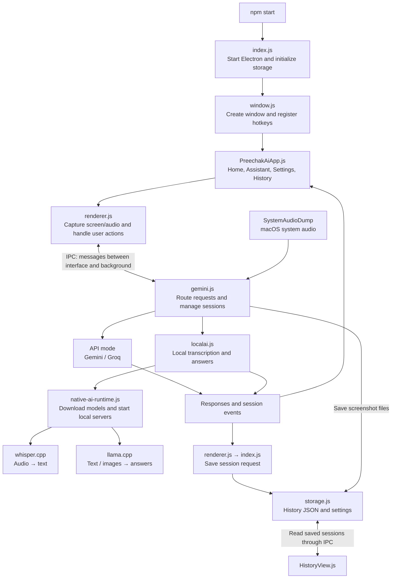
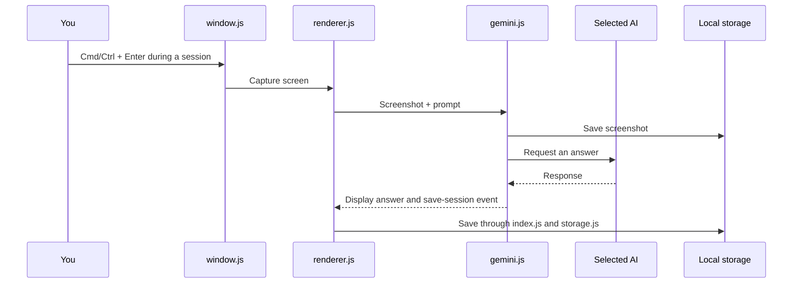

# How Preechak AI works

The app has three main parts: the interface, AI processing, and local storage. These Mermaid diagrams render directly on GitHub.

## How the pieces connect

IPC is Electron's messaging system: the visible interface asks the background process to perform actions and receives results. The diagram summarizes logical connections; history reads and writes pass through the renderer's storage wrapper and the handlers in `index.js`.

## How a question becomes an answer

| Input          | API mode (Live WebSocket)                                                                                           | API mode (Buffered HTTP)                                                                                                               | Local mode                                                                           |
| -------------- | ------------------------------------------------------------------------------------------------------------------- | -------------------------------------------------------------------------------------------------------------------------------------- | ------------------------------------------------------------------------------------ |
| Spoken audio   | Gemini Live streams continuous transcription; Groq generates answers when configured, otherwise Gemini Live answers | Audio is buffered and segment-packaged upon speech pauses; Gemini transcribes/answers via HTTP REST, or forwards transcription to Groq | Whisper transcribes audio segments locally, then llama.cpp generates an answer       |
| Typed question | Groq when configured; otherwise Gemini request path                                                                 | Groq when configured; otherwise Gemini HTTP model                                                                                      | Goes directly to llama.cpp                                                           |
| Screenshot     | Groq image model when configured; otherwise Gemini image request                                                    | Groq image model when configured; otherwise Gemini HTTP model image request                                                            | Goes to the local model through llama.cpp; image support requires a compatible model |

The selected profile and custom instructions are added through `prompts.js`.

## Example: pressing the screenshot hotkey

From the home screen, the same shortcut starts a session instead of capturing a screenshot.

## Source map

Paths below are relative to the repository root.

| File                                    | Responsibility                                                                      |
| --------------------------------------- | ----------------------------------------------------------------------------------- |
| `src/index.js`                          | Electron startup, storage handlers, and general app actions                         |
| `src/utils/window.js`                   | Window creation, visibility, hotkeys, click-through, and stealth mode               |
| `src/components/app/PreechakAiApp.js`   | Main interface, navigation, and session controls                                    |
| `src/components/views/AssistantView.js` | Responses, typed questions, and screenshot controls                                 |
| `src/components/views/HistoryView.js`   | Browse, rename, search, and delete saved sessions                                   |
| `src/utils/renderer.js`                 | Capture, interface-to-background requests, and session-save event handling          |
| `src/utils/gemini.js`                   | AI request routing, Gemini/Groq connections, session events, and macOS system audio |
| `src/utils/gemini-http.js`              | HTTP REST audio buffering, VAD segmentation, and Gemini/Groq request execution      |
| `src/utils/localai.js`                  | Local audio processing, transcription, and text/image inference                     |
| `src/utils/native-ai-runtime.js`        | Native runner/model downloads and local server support                              |
| `src/utils/prompts.js`                  | Profile-specific AI instructions                                                    |
| `src/storage.js`                        | JSON settings, credentials, sessions, and screenshot files                          |

## Implementation notes

- `gemini.js` is the central AI controller, including routing to local AI, despite its name.
- On macOS, history lives outside the project directory under `~/Library/Application Support/preechak-ai-config`.
- Local AI runs separate background programs for Whisper and llama.cpp.
- `cloud.js` still exists, but its setup option is disabled in the current interface.
- Some comments mention IndexedDB, but the current history-saving path writes JSON files through `storage.js`.

This document describes the source reviewed on September 28, 2026; it is an architecture overview, not a runtime test report.
