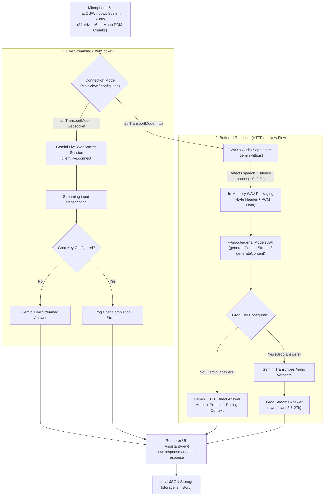

# HTTP-Based Gemini Architecture

This document explains the **HTTP-based Gemini integration** added to Preechak AI, how it works alongside the existing **WebSocket Live** streaming pipeline, and how audio, transcription, context, and responses are processed.

---

## 1. Overview & Motivation

Preechak AI originally supported real-time streaming audio exclusively via **Gemini Live** over bidirectional WebSockets (e.g. `gemini-3.1-flash-live-preview`).

While Gemini Live provides immediate real-time feedback, it requires models specifically enabled for bidirectional live session protocols. Adding an **HTTP-based transport flow** provides several key advantages:

1. **Broad Model Compatibility**: Enables the use of any standard Gemini model (e.g., `gemini-3.8-flash`, `gemini-2.0-flash`, `gemini-1.5-pro`, `gemini-1.5-flash`, etc.) via standard Google GenAI HTTP REST endpoints.
2. **Dual-Flow Coexistence**: Users can switch seamlessly between **Live Streaming (WebSocket)** and **Buffered Requests (HTTP)** directly from the Home screen without losing the original live streaming workflow.
3. **Flexible Answer Generation**: Supports both **Direct Gemini Audio Answers** (where Gemini listens to the audio and generates the response directly) and **Groq Answers with Gemini Transcription** (where Gemini transcribes speech verbatim and Groq generates the response).

---

## 2. Architecture & Data Flow

---

## 3. How the HTTP Audio Pipeline Works

### Step 1: Ingestion & Voice Activity Detection (VAD)

- Incoming audio chunks (100 ms duration, 24 kHz mono PCM) from system audio (`SystemAudioDump` on macOS / loopback on Windows) and microphone input are passed to `processHttpAudioChunk()` in `src/utils/gemini-http.js`.
- The segmenter computes Root-Mean-Square (RMS) audio energy (`getPcmEnergy`).
- When energy exceeds the threshold (`ENERGY_THRESHOLD = 60`), speech frames are accumulated.

### Step 2: Speech Pause & Boundary Detection

- The segmenter monitors consecutive silence frames:
    - **Interviews / Default**: ~1.0 second silence pause threshold.
    - **Meetings / Presentations / Negotiations**: ~2.0 seconds silence pause threshold.
- When silence is detected following active speech (or if audio accumulation reaches a maximum 15-second duration limit), the accumulated speech chunk is finalized.
- Short noise clicks (< 0.4 seconds) are automatically filtered out.

### Step 3: In-Memory WAV Packaging

- The raw PCM buffer is packaged into a standard RIFF/WAVE header (`createWavBuffer`) in memory (24 kHz, 16-bit mono PCM).
- The WAV buffer is converted to a base64 string for transmission via `inlineData: { mimeType: 'audio/wav', data: base64Wav }`.

### Step 4: Context Management, Shared Screenshots & Token Budgeting

Rather than using a fixed message slice, HTTP mode manages conversation context dynamically and shares history between speech, text, and screenshot turns:

- **Unified Conversation History**: Spoken turns, typed messages, and screenshot analyses share the same logical history (`httpConversationHistory`).
- **Active Screenshot Attachments**: Capturing a screen automatically activates that screenshot for subsequent voice or text follow-up queries without guessing or keyword triggers.
- **Attachment Controls in UI**:
    - **Remove**: Exclude an image without deleting the saved screenshot file on disk.
    - **Compare with previous**: Attach both the latest and preceding captures with distinct ordering labels (`[Attached Image 1 (Current)]`, `[Attached Image 2 (Previous)]`).
    - **History Picker**: Re-attach any earlier capture from the current session (up to 2 active images).
- **Queue Snapshotting**: Spoken questions snapshot active attachment IDs at speech-segment start, ensuring subsequent screenshots taken during transcription do not contaminate older questions.
- **Recent History Token Budget**: Scans backward from the most recent turn to include full exchanges up to a configurable budget (`httpRecentHistoryTokenBudget`, default `4000` tokens) retaining original `user` and `model` roles.
- **Running Summary of Older Context**: When the accumulated unsummarized history exceeds the token budget, the older turns are condensed via a background Gemini summarization call into a compact factual summary (`httpSummaryTargetTokens`, default `500` tokens).
- **Speaker & Attribution Preservation**: The summary distinguishes between what the interviewer asked, what the user said (`[You]`), screenshot analyses, and what was suggested by the assistant (`[AI Suggested Answer]`).
- **Token Estimation**: Each attached image contributes ~258 tokens to request context statistics. Images are stored on disk and cached in bounded in-memory storage (LRU).
- **Resilient Fallback**: If summarization fails or encounters rate limits, the previous summary and bounded recent turns are safely retained without disrupting user responses or session history.

### Step 5: AI Model Execution & Streaming

- **Branch A: Direct Gemini Answer (Default when no Groq key)**:
    - Calls `ai.models.generateContentStream` with the configured `geminiHttpModel` (e.g. `gemini-3.8-flash`).
    - Passes the system prompt (from `prompts.js` with profile instructions and constraints).
    - Injects the running conversation summary (if present) followed by the budgeted recent turns, any active image attachments, and the current question.
    - Streams chunks to the UI via `new-response` (first chunk) and `update-response` (subsequent chunks).
    - Saves the complete turn to local storage history on completion.
- **Branch B: Groq Answer Mode (When Groq key is present)**:
    - First calls Gemini HTTP with a verbatim transcription prompt to extract the speech text.
    - Emits `live-transcription` to display what was spoken.
    - Forwards the transcription to Groq to stream the response (defaulting to `qwen/qwen3.6-27b`).

---

## 4. Mode Comparison

| Feature                 | Live WebSocket (`websocket`)                               | Buffered HTTP (`http`)                                                           | Local AI (`local`)                              |
| ----------------------- | ---------------------------------------------------------- | -------------------------------------------------------------------------------- | ----------------------------------------------- |
| **Connection Protocol** | Bidirectional WebSocket (`client.live.connect`)            | HTTP REST (`ai.models.generateContentStream`)                                    | Local child processes (Whisper + Llama servers) |
| **Supported Models**    | Live-enabled models (e.g. `gemini-3.1-flash-live-preview`) | Any Gemini model (e.g. `gemini-3.8-flash`, `gemini-2.0-flash`, `gemini-1.5-pro`) | GGUF models (`Qwen3.5`, `Llama-3`, etc.)        |
| **Audio Processing**    | Continuous 100 ms streaming chunks                         | VAD-segmented WAV audio upon speech pauses                                       | Local VAD + 16 kHz resampled WAV to whisper.cpp |
| **Internet Required**   | Yes                                                        | Yes                                                                              | No (after initial download)                     |
| **Groq Acceleration**   | Supported                                                  | Supported                                                                        | N/A (runs local Llama)                          |

---

## 5. Source Code Map & Modified Files

| File                                                                                                            | Purpose & Changes                                                                                                                                                                                         |
| --------------------------------------------------------------------------------------------------------------- | --------------------------------------------------------------------------------------------------------------------------------------------------------------------------------------------------------- |
| [src/utils/gemini-http.js](file:///Users/phillip/projects/preechak-ai/src/utils/gemini-http.js)                 | **New module**. Implements VAD segmentation, in-memory WAV packaging, rolling conversation context, and streaming request execution for both Gemini and Groq.                                             |
| [src/utils/gemini.js](file:///Users/phillip/projects/preechak-ai/src/utils/gemini.js)                           | Integrated `gemini-http.js` into session lifecycle (`initialize-gemini`, `send-audio-content`, `send-mic-audio-content`, `send-text-message`, `close-session`), routing between WebSocket and HTTP modes. |
| [src/storage.js](file:///Users/phillip/projects/preechak-ai/src/storage.js)                                     | Added `apiTransportMode` (`'websocket'` / `'http'`) and `geminiHttpModel` (`'gemini-3.8-flash'`) to default configuration.                                                                                |
| [src/components/views/MainView.js](file:///Users/phillip/projects/preechak-ai/src/components/views/MainView.js) | Added UI controls to switch between **Live Streaming (WebSocket)** and **Buffered Requests (HTTP)** and configure the respective model names.                                                             |
| [documents/architecture.md](file:///Users/phillip/projects/preechak-ai/documents/architecture.md)               | Updated architecture diagram, tables, and source map to document the dual API transport modes.                                                                                                            |
| [README.md](file:///Users/phillip/projects/preechak-ai/README.md)                                               | Added setup and configuration instructions for both connection modes.                                                                                                                                     |

---

## 6. How to Use in the App

1. Launch the app (`npm start`).
2. On the Home screen under **Gemini API & Connection**:
    - Enter your **Gemini API Key**.
    - Set **Connection Mode** to **Buffered Requests (HTTP)**.
    - Specify your desired **Gemini HTTP Model** (default is `gemini-3.8-flash`; you can also use `gemini-2.0-flash`, `gemini-1.5-pro`, etc.).
3. (Optional) Under **AI responses**, provide a Groq API key if you wish to use Groq for answer generation.
4. Click **Start Session**.
5. Speak or play system audio — the assistant will automatically segment pauses, query Gemini via HTTP, and stream concise answers to your overlay.
