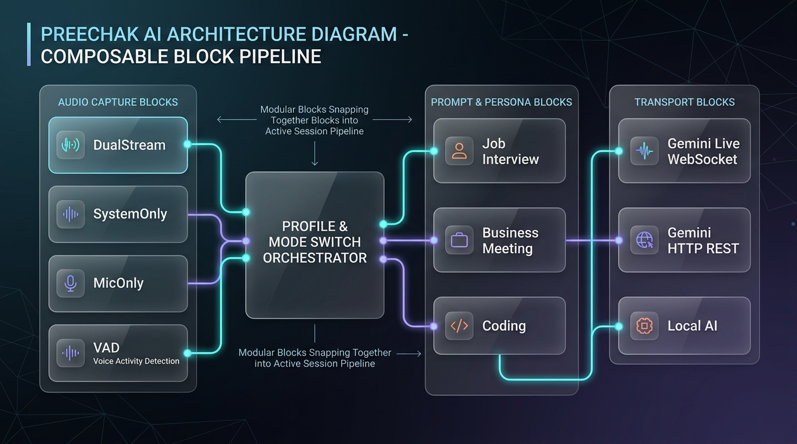
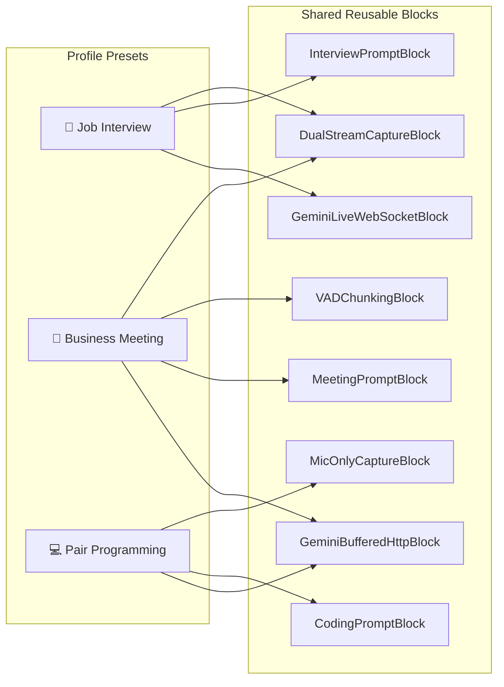

# Modular Pipeline & Profile Architecture

Preechak AI uses a **Composable Pipeline Architecture** with reusable building blocks. Rather than rewriting or duplicating audio and AI logic for different profiles (such as Job Interview, Business Meeting, or Pair Programming), the system uses a central registry of reusable blocks that are assembled on demand.

## Core Architectural Concepts

1. **Reusable Block Registry (`src/services/blockRegistry.js`)**:
    - Audio Capture Blocks (DualStream, SystemAudioOnly, MicOnly, VAD)
    - Prompt & Persona Blocks (Job Interview, Business Meeting, Coding, etc.)
    - Transport & Dispatch Blocks (Gemini Live WebSocket, Gemini HTTP REST, Local AI)
2. **Profile Orchestrator (`src/services/profileOrchestrator.js`)**:
    - Resolves profile recipes and coordinates mode transitions.
    - Hot-swaps pipeline parameters when profiles change without tearing down shared hardware devices.
3. **Session Manager (`src/services/sessionManager.js`)**:
    - Manages runtime session state (`idle` → `starting` → `active` → `stopped`).
    - Acts as the clean single entrypoint for UI components.

## Pipeline Composition Map

## Source Map

| Service                  | File Path                                                                                                               | Responsibility                                                          |
| :----------------------- | :---------------------------------------------------------------------------------------------------------------------- | :---------------------------------------------------------------------- |
| **Block Registry**       | [`src/services/blockRegistry.js`](file:///Users/phillip/projects/preechak-ai/src/services/blockRegistry.js)             | Central registry for registering and retrieving modular blocks.         |
| **Audio Blocks**         | [`src/services/audioCaptureBlocks.js`](file:///Users/phillip/projects/preechak-ai/src/services/audioCaptureBlocks.js)   | Reusable audio capture strategies (Dual-stream, Mic-only, System-only). |
| **Prompt Blocks**        | [`src/services/promptBlocks.js`](file:///Users/phillip/projects/preechak-ai/src/services/promptBlocks.js)               | Reusable persona prompts and instruction templates.                     |
| **Transport Blocks**     | [`src/services/transportBlocks.js`](file:///Users/phillip/projects/preechak-ai/src/services/transportBlocks.js)         | Dispatchers for Gemini Live, Gemini HTTP REST, and Local AI.            |
| **Profile Orchestrator** | [`src/services/profileOrchestrator.js`](file:///Users/phillip/projects/preechak-ai/src/services/profileOrchestrator.js) | Profile recipe resolution and mode switch coordinator.                  |
| **Session Manager**      | [`src/services/sessionManager.js`](file:///Users/phillip/projects/preechak-ai/src/services/sessionManager.js)           | Unified entrypoint for starting, stopping, and monitoring sessions.     |

## Credential loading

The renderer is loaded as a classic script by `src/index.html`. Electron resolves its CommonJS imports relative to that HTML entry point, so the services import must use `./services`, not `../services`. A failed bootstrap prevents the storage API from being exposed and leaves saved credentials blank in the interface. Credential loading is independent of configuration and preferences failures, and the key is synchronized into the password input after rendering.

Regression coverage: `node --test tests/credential-loading.test.cjs`.
