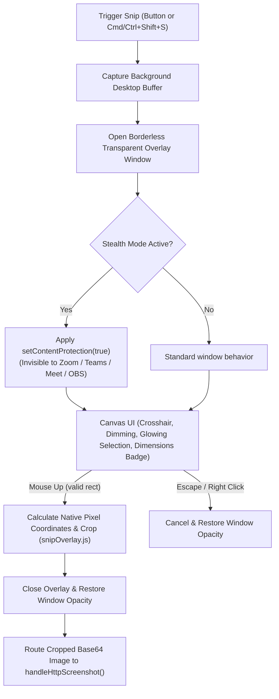

# Screen Snip & Area Selection

This document describes the interactive area selection (snip tool), coordinate scaling, stealth protection, and integration with the Gemini analysis pipeline in Preechak AI.

---

## 1. Overview

Preechak AI supports both full-display screen captures and interactive **region selection (snipping)**. The snip tool allows users to click and drag a rectangular bounding box with their mouse to capture and analyze a specific portion of their screen (e.g. a code editor, terminal output, or a diagram) without surrounding desktop clutter.

---

## 2. Architecture & Data Flow



---

## 3. Key Components & Implementation

1. **Snip Overlay Module (`src/utils/snipOverlay.js`)**:
    - `captureDisplayBuffer()`: Captures clean desktop pixels beneath the floating Preechak window.
    - `normalizeSelection()`: Re-orders coordinates when dragging in any direction (top-left, bottom-right, reverse).
    - `calculateCropBounds()`: Scales display-logical pixels $(x, y, w, h)$ to native display pixel dimensions (Retina/HiDPI $2\times$, $3\times$) and clamps them strictly within image boundaries.
    - `validateCropDimensions()`: Enforces a minimum dimension ($\ge 10\times 10\text{px}$) to prevent accidental single-pixel clicks.

2. **Stealth Mode Content Protection & Dynamic Cursor**:
    - The snip overlay window inherits `stealthModeEnabled`.
    - When enabled, `snipWindow.setContentProtection(true)` is applied, ensuring that the dimmed backdrop and selection rectangle are **100% hidden from screen sharing software (Zoom, Teams, Google Meet, Discord, OBS)** while remaining clearly visible on the user's physical monitor.
    - **Stealth-Aware Mouse Cursor**: When stealth mode is active, the mouse cursor stays as the standard mouse arrow (`cursor: default`) so screen share viewers see normal pointer behavior. When stealth mode is disabled, it switches to a precision crosshair (`cursor: crosshair`).

3. **User Controls & Shortcuts**:
    - **Shortcut**: `Cmd+Shift+S` (macOS) / `Ctrl+Shift+S` (Windows/Linux) - Configurable in **Settings → Shortcuts**.
    - **UI Action**: Dedicated **Snip** button in the [AssistantView.js](file:///Users/phillip/projects/preechak-ai/src/components/views/AssistantView.js) input bar.

---

## 4. Verification

Run the snip overlay test suite:

```bash
node --test tests/snip-overlay.test.cjs
```
