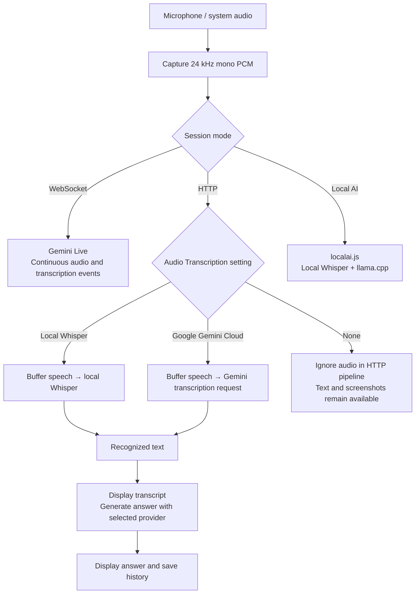
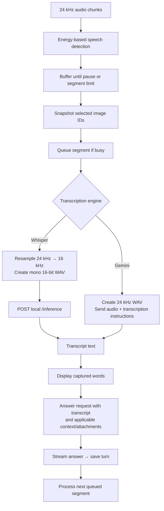
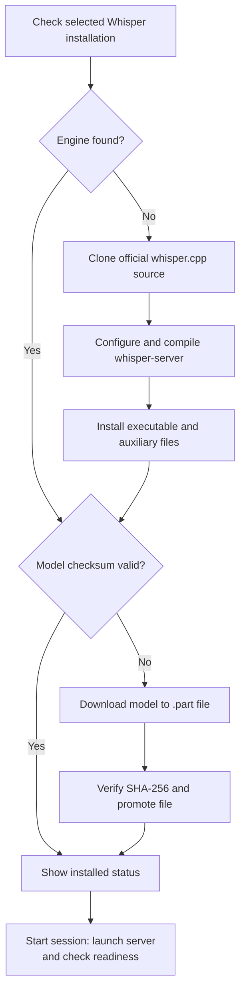

# Transcription flow

This document describes the source as reviewed on September 29, 2026. Transcription converts captured speech into text; answer generation uses that text to produce a response. These are separate steps. Diagrams use Mermaid and render on GitHub.

## Modes and defaults

The app has three audio paths:

| Session mode | Transcription | Answer generation |
| --- | --- | --- |
| Gemini Live / WebSocket | Gemini Live receives continuous audio and returns transcription events | Gemini Live, or Groq when configured |
| Gemini HTTP | Local Whisper, Gemini cloud transcription, or no audio transcription | Existing HTTP answer pipeline: Gemini, or Groq when configured |
| Local AI | Local Whisper through the existing combined local runtime | Local llama.cpp model |

The source defaults to API-key mode with a WebSocket connection. For HTTP sessions, the current preference default is `geminiHttpTranscriptionMode: 'whisper'` and the Whisper model defaults to `base.en`. Saved preferences can override these values. Compatibility code also reads the older `geminiHttpLocalWhisper` preference when the mode field is absent.

Under Gemini HTTP settings, **Audio Transcription** offers:

- **Local Whisper (whisper.cpp · Offline)**
- **Google Gemini Cloud**
- **No Transcription (Manual Screenshots & Text Only)**

The selector is disabled during an active session. “Offline” describes Whisper transcription, not the entire HTTP session: transcripts are still sent to the remote answer provider, and selected screenshots may also be included.

## Overall routing



On macOS, system audio comes from the SystemAudioDump helper. Microphone audio comes through browser audio capture. Windows/Linux capture paths feed audio through Electron messages. `gemini.js` routes audio according to the active provider and connection mode.

## HTTP speech segmentation and processing

The HTTP pipeline operates on completed speech segments, not continuously updated word-by-word transcripts.

1. `processHttpAudioChunk()` receives audio chunks, normally representing about 100 ms each.
2. It measures audio energy and detects speech. The configurable energy threshold is clamped to the range defined in the code.
3. It accumulates speech until a profile-dependent silence threshold or the maximum chunk count is reached.
4. At that segment boundary, it snapshots the active screenshot attachment IDs.
5. Segments shorter than 0.4 seconds are skipped. If another speech turn is processing, the segment and its attachment IDs enter the pending queue.
6. The chosen engine transcribes the audio.
7. Empty transcripts are skipped. A nonempty transcript is displayed with its speaker label and used for the answer request.
8. Session-generation checks prevent obsolete results from updating a restarted session.

The current limits and pause calculations assume the expected chunk cadence. Energy detection is a simple volume-based heuristic, not a separate learned speech-detection model. Source labels such as “You” and “Interviewer” are app routing labels, not identity recognition by Whisper.



### Local Whisper in an HTTP session

`gemini-http.js` uses the standalone `whisper-runtime.js` module. It starts Whisper without starting llama.cpp.

The runtime launches `whisper-server` bound to `127.0.0.1` on an available port. It sends a multipart HTTP request to `/inference` containing:

- A WAV file with 16 kHz, mono, 16-bit audio.
- `response_format=json`.
- `temperature=0.0`.
- `language=en`.

The response's `text` field becomes the transcript. The available `tiny.en`, `base.en`, and `small.en` models and current language setting are English-only.

```mermaid
sequenceDiagram
    participant App as Gemini HTTP session
    participant Runtime as whisper-runtime.js
    participant Whisper as Local whisper-server
    participant Gemini as Gemini HTTP answer model
    participant UI as Interface / history
    App->>Runtime: Start selected Whisper model
    Runtime->>Whisper: Launch on 127.0.0.1
    Runtime->>Whisper: Check server readiness
    App->>Runtime: Completed speech segment
    Runtime->>Whisper: POST /inference with WAV
    Whisper-->>Runtime: Transcript JSON
    Runtime-->>App: Recognized text
    App->>UI: Show transcript
    App->>Gemini: Transcript + profile + conversation context + selected images
    Gemini-->>UI: Streamed answer via app
    App->>UI: Save conversation turn
    Note over App,Gemini: Diagram shows the Gemini answer branch; Groq remains an alternative when configured.
```

If Whisper fails to start, HTTP session initialization fails visibly. A transcription failure produces an error event; the code does not silently upload that audio to Gemini. Closing the HTTP session stops its Whisper server, clears queued speech, and resets session context and attachments.

### Gemini cloud transcription

The completed audio segment is sent to Gemini with instructions to transcribe the spoken words rather than answer them. The resulting transcript then enters the answer stage. Gemini-only HTTP mode therefore uses separate transcription and answer requests.

For Gemini answers, the context builder includes recent conversation entries, any running summary, profile instructions, and applicable selected image attachments. Transcription itself does not need the full answer history.

### No transcription

`processHttpAudioChunk()` returns without processing audio when the mode is `none`. Typed questions and manual screenshot requests can still use the HTTP answer pipeline. This mode does not create audio transcripts.

## Whisper installation and progress

There are two distinct components: the compiled engine and its speech model.

| Component | Current source / preparation |
| --- | --- |
| HTTP Whisper engine | Build locally from `https://github.com/ggml-org/whisper.cpp.git` |
| English speech models | Download from `https://huggingface.co/ggerganov/whisper.cpp` |

`downloadWhisperComponents()` reuses a found engine and a model that passes its configured SHA-256 check. If the engine is missing, it calls `buildWhisperEngineFromSource()`; if the model is missing or invalid, it downloads the model.

The current source build uses a shallow clone without a pinned tag or commit. It configures CMake with `BUILD_SHARED_LIBS=OFF`, `WHISPER_BUILD_SERVER=ON`, and a Release build. The installer copies `whisper-server` plus discovered auxiliary `.dylib`, `.metallib`, and `.metal` files into the binaries directory, then cleans up the temporary build directory.



The settings UI includes engine/model status, progress, cancellation, retry/repair, an open-folder action, and model removal. Model-download progress uses transferred bytes when available. Engine compilation reports build stages; its percentages are stage indicators, not measurements of remaining compilation time.

### Installed status versus a working engine

The current engine-status check mainly detects that an executable exists. It does not prove all dynamic libraries can be loaded. Model files receive checksum verification; engine launchability is exercised later at session startup.

For example, `dyld: Library not loaded: @rpath/libwhisper.1.dylib` means macOS cannot resolve a library required by the executable. This occurs before transcription; it does not imply the speech model is corrupt.

The current source includes static-library build flags, auxiliary-file copying, and `DYLD_LIBRARY_PATH` pointing at the installed binaries directory. Those changes are intended to address runtime dependencies, but this document does not certify a successful rebuild. A statically linked Whisper/GGML build can still depend on macOS system frameworks. An existing broken executable may still be detected as installed and skipped by “Download missing files.”

## File locations

`<config-dir>` is outside the source repository:

| Platform | Directory |
| --- | --- |
| macOS | `~/Library/Application Support/preechak-ai-config/` |
| Windows | `%USERPROFILE%\AppData\Roaming\preechak-ai-config\` |
| Linux | `~/.config/preechak-ai-config/` |

```text
<config-dir>/
├── preferences.json          # Transcription mode and selected model
├── binaries/
│   ├── whisper-server       # Source-built engine; platform names can vary
│   └── ...                  # Auxiliary runtime libraries/resources
├── models/whisper/
│   ├── ggml-tiny.en.bin
│   ├── ggml-base.en.bin
│   └── ggml-small.en.bin
├── history/                 # Saved transcripts and AI responses
└── logs/                    # Existing transport logs
```

Only selected/downloaded models need to exist. Source builds temporarily use `<config-dir>/temp-whisper-build-.../`. Recognition requests construct WAV data in memory. Separate optional audio-debug recording behavior is documented in the README.

## Relationship to full Local AI mode

Full Local AI still uses `localai.js` and `native-ai-runtime.js` to prepare and start both Whisper and llama.cpp. Its audio detection and history handling are separate from the Gemini HTTP implementation.

Do not assume changing the HTTP Whisper installer also changes the combined Local AI installer. The latter retains its own native-runner release configuration. In full Local AI mode, the transcript goes to llama.cpp; in HTTP-plus-Whisper mode, it goes to the remote answer pipeline.

## Source map

| Source file | Responsibility |
| --- | --- |
| `src/components/views/MainView.js` | Transcription selector, model selection, installation status, and progress controls |
| `src/storage.js` | Default preferences, saved settings, and history files |
| `src/utils/renderer.js` | Capture and renderer/background messages |
| `src/utils/gemini.js` | Route audio into Live, HTTP, or Local AI paths |
| `src/utils/gemini-http.js` | HTTP speech buffering, queues, engine selection, transcript display, and answer context |
| `src/utils/whisper-runtime.js` | Standalone Whisper build/download/status, server lifecycle, resampling, and transcription requests |
| `src/utils/localai.js` | Combined local Whisper + llama.cpp session |
| `src/utils/native-ai-runtime.js` | Runtime/model preparation used by combined Local AI |

This is a source-based description. No model download, compilation, server launch, or live transcription test was performed to produce it.
